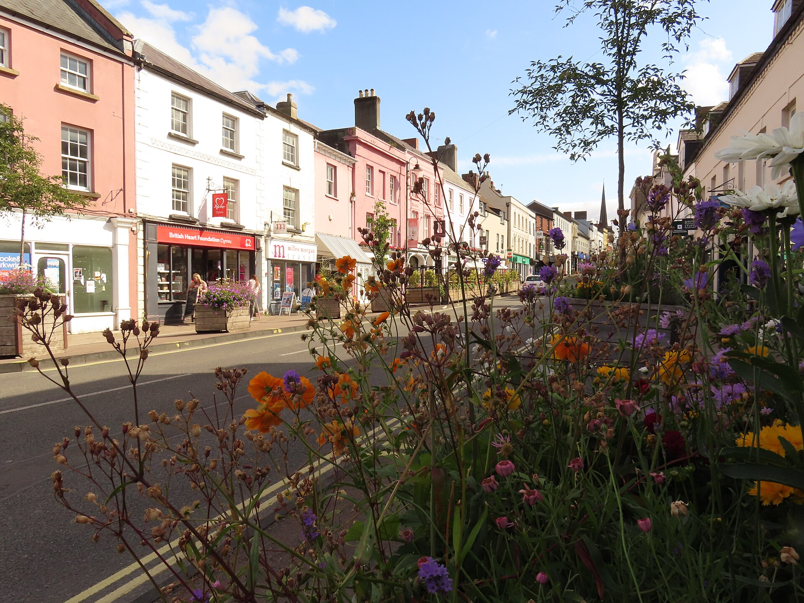
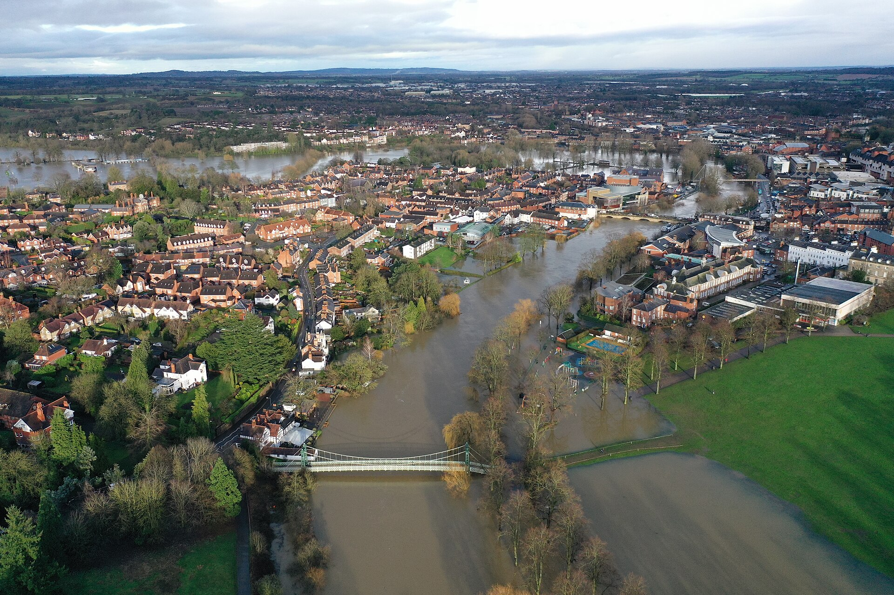
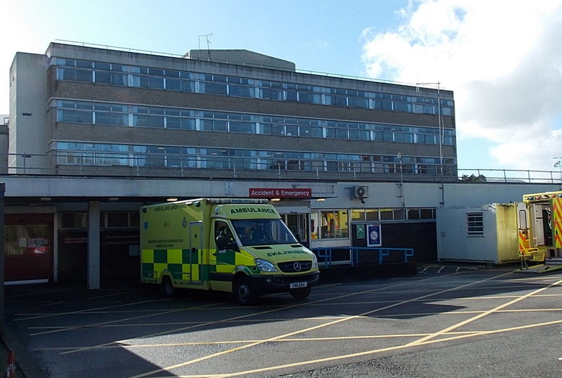
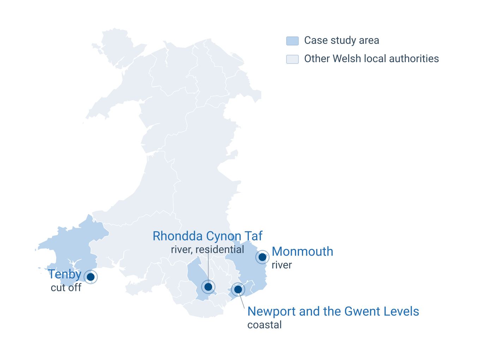

## Monmouth, November 2024

A community hospital takes on water. Staff move every patient up to the first floor and wait there. Their access is cut off until the water level drops.

. . .

On the city's main street, a pharmacy, a dentist, and a GP surgery all flood at once.

. . .

The water never reaches the electrical substations, but they fail anyway. Power is gone for up to 48 hours, and people on home oxygen and dialysis machines, well outside the flooded streets, are suddenly at risk.

. . .

[This is what flooding disruption to healthcare actually looks like. My PhD is about understanding it, measuring it, and planning for it.]{.remember}

::: {.notes}
About 75 seconds. Open slowly, tell it as a story. This is a real Welsh case, Storm Bert in Monmouth, from Public Health Wales. Useful follow-on fact for questions: the GP surgery, Castlegate, was displaced to another site for over six months. The point to land: the damage is rarely just the flooded building, it is the cascade. Hold the last line, then move to the photo. This is an OR audience, so they will know the methods but not the Welsh health system, and the story is what makes the problem concrete before any method appears.
:::

## Three health services sit on this one street

{fig-align="center" width="25%"}

::: {.textcenter}
[Monnow Street, Monmouth.]{style="font-size:0.55em; font-style:italic;"}
:::

::: {.notes}
About 25 seconds. Do not linger. Point out that this is an ordinary Welsh market town high street, not an obvious disaster zone, and that three separate health services sit along it. The single sentence to say out loud: when this street floods you do not lose one building, you lose a cluster of services that patients depend on together. Then move on.
:::

## What I will cover

1. [**The problem**]{.remember}
2. [Interconnected research directions]{.graylight}
3. [WP1: mapping how floods disrupt care]{.graylight}
4. [WP2 and WP3: measure it, then plan for it]{.graylight}
5. [Key Takeaways]{.graylight}

::: {.notes}
15 seconds. One line each, then move. The agenda comes back once, before part four, so the room always knows where we are.
:::

## The question behind everything

Floods and rising sea levels keep disrupting how healthcare is delivered in Wales. We map where the water goes, but we do not map what stops working.

- Roughly one in eight properties in Wales sits at flood risk, and the climate signal points to wetter winters and higher seas [^nrw]
- There is no central record of how floods disrupt healthcare delivery, who it hits, or for how long [^phw]

[How do floods disrupt healthcare service delivery, and what can we do about it?]{.remember}

[^nrw]: Natural Resources Wales
[^phw]: Public Health Wales

::: {.notes}
About 1 minute. Establish the gap clearly for a mixed audience: flood maps tell us which buildings get wet, and say nothing about which services fail and for whom. That blind spot is the service layer, and it is where the whole PhD sits. Read the research question out loud.
:::

## We can see the water coming. We cannot see what services it disrupt,

{fig-align="center" width="28%"}

::: {.textcenter}
[A river overflowing through a riverside town]{style="font-size:0.55em; font-style:italic;"}
:::

::: {.notes}
About 30 seconds. This is the hazard layer, and it is the part we are already good at. River gauges, rainfall radar, and flood warnings describe this water very well. Say the contrast plainly: hydrology tells us where the water will be, and nothing in that forecast tells a health board which clinics will close, which staff will not get in, or which patients will miss dialysis. That gap between a well modelled hazard and an unmodelled service consequence is the whole reason this project exists. Then move to the work packages.
:::

## What I will cover

1. [The problem]{.graylight}
2. [**Interconnected research directions**]{.remember}
3. [WP1: mapping how floods disrupt care]{.graylight}
4. [WP2 and WP3: measure it, then plan for it]{.graylight}
5. [Key Takeaways]{.graylight}

## Three connected packages, one thread

<svg viewBox="0 0 1680 230" xmlns="http://www.w3.org/2000/svg" role="img" aria-label="WP1 leads to WP2 leads to WP3" style="width:100%;max-width:1200px;height:auto;display:block;margin:0 auto;">
  <g fill="#e3edf9" stroke="#7ba3d4" stroke-width="1.5">
    <rect x="15" y="50" width="350" height="130" rx="6"/>
    <rect x="665" y="50" width="350" height="130" rx="6"/>
    <rect x="1315" y="50" width="350" height="130" rx="6"/>
  </g>
  <g stroke="#8a97a6" stroke-width="2" fill="none">
    <line x1="365" y1="115" x2="665" y2="115"/>
    <line x1="1015" y1="115" x2="1315" y2="115"/>
  </g>
  <g fill="#8a97a6">
    <path d="M665 115 L653 109 L653 121 Z"/>
    <path d="M1315 115 L1303 109 L1303 121 Z"/>
  </g>
  <g fill="#eef1f4" stroke="none">
    <rect x="395" y="92" width="240" height="46"/>
    <rect x="1045" y="92" width="240" height="46"/>
  </g>
  <g font-family="system-ui,-apple-system,'Segoe UI',Roboto,'Helvetica Neue',Arial,sans-serif" font-size="22" fill="#33495d" text-anchor="middle">
    <text x="515" y="104" dominant-baseline="central">drivers become features,</text>
    <text x="515" y="126" dominant-baseline="central">disruption labels</text>
    <text x="1165" y="104" dominant-baseline="central">today's vulnerability</text>
    <text x="1165" y="126" dominant-baseline="central">is the baseline</text>
  </g>
  <g font-family="system-ui,-apple-system,'Segoe UI',Roboto,'Helvetica Neue',Arial,sans-serif" font-size="25" fill="#1f6db4" text-anchor="middle">
    <text x="190" y="82" dominant-baseline="central">WP1</text>
    <text x="190" y="115" dominant-baseline="central">How floods disrupt</text>
    <text x="190" y="148" dominant-baseline="central">healthcare delivery</text>
    <text x="840" y="82" dominant-baseline="central">WP2</text>
    <text x="840" y="115" dominant-baseline="central">Which facilities are vulnerable,</text>
    <text x="840" y="148" dominant-baseline="central">what are vulnerability drivers</text>
    <text x="1490" y="82" dominant-baseline="central">WP3</text>
    <text x="1490" y="115" dominant-baseline="central">Planning resilience</text>
    <text x="1490" y="148" dominant-baseline="central">under uncertainty</text>
  </g>
</svg>

Each package feeds the next. WP1 defines what the models need to consider and measure, and the current vulnerability defines what the future planning adapts.

::: {.notes}
About 1 minute. This is the spine of the talk. WP1 establishes what actually happens, because right now the evidence itself is missing. WP2 turns those mechanisms into measurement: which facilities are vulnerable, and what a flood causally does to demand. WP3 takes today's picture into futures we cannot assign probabilities to, and plans under that. The arrows are the argument: you cannot model vulnerability well until the qualitative work tells you what to model, and you cannot plan for the future without a defensible baseline. I will spend most time on WP1, since it is furthest along, then sketch the other two.
:::

## What I will cover

1. [The problem]{.graylight}
2. [Interconnected research directions]{.graylight}
3. [**WP1: mapping how floods disrupt care**]{.remember}
4. [WP2 and WP3: measure it, then plan for it]{.graylight}
5. [Key Takeaways]{.graylight}

## Disruption propagates, it does not stay put

Healthcare delivery is a system of interdependent parts. A flood is a shock that propagates through them.

<svg viewBox="0 0 1520 300" xmlns="http://www.w3.org/2000/svg" role="img" aria-label="Five-layer disruption cascade" style="width:100%;max-width:1180px;height:auto;display:block;margin:0 auto;">
  <g fill="#e3edf9" stroke="#7ba3d4" stroke-width="1.5">
    <rect x="20"   y="20" width="330" height="110" rx="6"/>
    <rect x="395"  y="20" width="330" height="110" rx="6"/>
    <rect x="770"  y="20" width="330" height="110" rx="6"/>
    <rect x="1145" y="20" width="330" height="110" rx="6"/>
  </g>
  <g stroke="#8a97a6" stroke-width="2" fill="none">
    <path d="M352 75 L391 75"/>
    <path d="M727 75 L766 75"/>
    <path d="M1102 75 L1141 75"/>
  </g>
  <g fill="#8a97a6">
    <path d="M393 75 L381 69 L381 81 Z"/>
    <path d="M768 75 L756 69 L756 81 Z"/>
    <path d="M1143 75 L1131 69 L1131 81 Z"/>
  </g>
  <g stroke="#c4d3e6" stroke-width="1.5">
    <path d="M185 130 L185 168"/>
    <path d="M560 130 L560 168"/>
    <path d="M935 130 L935 168"/>
    <path d="M1310 130 L1310 168"/>
  </g>
  <rect x="20" y="170" width="1455" height="86" rx="6" fill="#eef3f9" stroke="#9bb6d6" stroke-width="1.5"/>
  <g font-family="system-ui,-apple-system,'Segoe UI',Roboto,'Helvetica Neue',Arial,sans-serif" text-anchor="middle">
    <g font-size="24" fill="#1f6db4">
      <text x="185"  y="62">A · Hazard</text>
      <text x="560"  y="62">B · Infrastructure</text>
      <text x="935"  y="62">C · Facility &amp; workforce</text>
      <text x="1310" y="62">D · Demand</text>
    </g>
    <g font-size="18" fill="#33495d">
      <text x="185"  y="98">the flood itself</text>
      <text x="560"  y="98">power, water, transport, IT</text>
      <text x="935"  y="98">closures, staff cannot reach</text>
      <text x="1310" y="98">can patients still reach care</text>
    </g>
  </g>
  <g font-family="system-ui,-apple-system,'Segoe UI',Roboto,'Helvetica Neue',Arial,sans-serif" text-anchor="middle">
    <text x="747" y="206" font-size="24" fill="#1f6db4">X · Cross-cutting cascades</text>
    <text x="747" y="236" font-size="18" fill="#33495d">across layers, over time, and reaching facilities that never flood</text>
  </g>
</svg>

[A facility can stay completely dry and still stop delivering care. Monmouth proved it.]{.remember}

::: {.notes}
About 1 minute, and this is the conceptual spine of WP1, distilled from a structured synthesis of about 70 studies across more than 20 countries. Walk it left to right. Layer A is the flood. It knocks out the infrastructure care leans on, B: power, water, transport, IT. That hits the facility and its workforce, C: closures, and staff who cannot get in. That changes demand, D: who needs care and whether they can reach it. The band underneath, X, is the interesting part: failures cascade across layers, evolve over hours to months, and reach facilities that never flood, through a severed road or a lost substation. On current evidence the dominant pathways are access, power, and workforce, not the flooded building. That is exactly the Monmouth story from the opening, and the whole reason this needs more than a flood map.
:::

## A hospital can become an island without ever getting wet

{fig-align="center" width="25%"}

::: {.textcenter}
[Accident and Emergency, Nevill Hall Hospital, Abergavenny.]{style="font-size:0.55em; font-style:italic;"}
:::

::: {.notes}
About 30 seconds. This is a working Welsh NHS hospital in the same health board as the Monmouth case, with an ambulance at the A&E doors. Make the layer C point concrete: the building here is fine, the doors are open, the staff are willing. What fails is everything around it. If the access road floods, that ambulance diverts and outpatients do not arrive. If the substation goes, the site runs on generators with a limited window. If staff live on the far side of a closed bridge, the rota collapses. So the question a flood map cannot answer is not is this building wet, it is can care still be delivered from it. That is what WP1 is trying to make measurable.
:::

## Two methods, one picture

WP1 combines computational reach with qualitative depth.

<svg viewBox="0 0 1000 420" xmlns="http://www.w3.org/2000/svg" role="img" aria-label="NLP and interviews feed a disruption taxonomy and then effect sizes" style="width:100%;max-width:800px;height:auto;display:block;margin:0 auto;">
  <g fill="#e3edf9" stroke="#7ba3d4" stroke-width="1.5">
    <rect x="30" y="40" width="270" height="120" rx="6"/>
    <rect x="30" y="260" width="270" height="120" rx="6"/>
    <rect x="410" y="150" width="210" height="120" rx="6"/>
    <rect x="730" y="150" width="240" height="120" rx="6"/>
  </g>
  <g stroke="#8a97a6" stroke-width="2" fill="none">
    <path d="M300 100 C 360 100, 360 188, 410 188"/>
    <path d="M300 320 C 360 320, 360 232, 410 232"/>
    <line x1="620" y1="210" x2="730" y2="210"/>
  </g>
  <g fill="#8a97a6">
    <path d="M410 188 L398 182 L398 194 Z"/>
    <path d="M410 232 L398 226 L398 238 Z"/>
    <path d="M730 210 L718 204 L718 216 Z"/>
  </g>
  <g font-family="system-ui,-apple-system,'Segoe UI',Roboto,'Helvetica Neue',Arial,sans-serif" font-size="25" fill="#1f6db4" text-anchor="middle">
    <text x="165" y="70" dominant-baseline="central">Large-scale NLP</text>
    <text x="165" y="100" dominant-baseline="central">news, reports,</text>
    <text x="165" y="130" dominant-baseline="central">Senedd record</text>
    <text x="165" y="305" dominant-baseline="central">Case studies and</text>
    <text x="165" y="335" dominant-baseline="central">interviews in Wales</text>
    <text x="515" y="195" dominant-baseline="central">Disruption</text>
    <text x="515" y="225" dominant-baseline="central">taxonomy</text>
    <text x="850" y="195" dominant-baseline="central">Quantified</text>
    <text x="850" y="225" dominant-baseline="central">effect sizes</text>
  </g>
</svg>

The text gives breadth and the what. The interviews give the why and the cascades. Together they triangulate.

::: {.notes}
About 1 minute. Newspapers, reports, and parliamentary records tell you what happened but rarely why, and cascading effects mostly surface when you talk to the people who ran the response. So the NLP is one input into a case-study design, not the work package on its own. The final step quantifies effect sizes, anchored where possible in records rather than expert opinion alone. The next slide shows where the four cases sit.
:::

## Four contrasting cases, four flood mechanisms

{fig-align="center" width="33%"}

::: {.textcenter}
[Local authority boundaries: ONS Open Geography Portal.]{style="font-size:0.55em; font-style:italic;"}
:::

::: {.notes}
About 45 seconds, and this is the slide to guide people through properly, since most of the room will not know Welsh geography. Say first what the map is: all 22 Welsh local authorities, with the four case study areas shaded darker. Then walk the four. Monmouth in the east is river flooding in a market town. Rhondda Cynon Taf in the valleys is river flooding through dense residential streets. Newport and the Gwent Levels on the south coast is coastal and tidal. Tenby in the far west is the cut-off case, where the town is not flooded but the roads in are. Land the design point: this is deliberate variation, not convenience sampling, because a comparative design needs contrast in both the mechanism and the population.
:::

## The evidence base is gathered

- First the academic literature: About 70 peer-reviewed studies from more than 20 countries
- Then the text corpus: Documents from news, grey literature, humanitarian reports, council papers, government publications, and the Senedd records
- Multiple filtering stages to keep documents relevant to the intersection of floods and healthcare service delivery, keep 84,877.

[Recall-first strategy, because a lost document costs evidence; an extra read only costs compute.]{.remember}

::: {.notes}
About 55 seconds. Two passes, and say them in order. Pass one is human reading: roughly 70 peer-reviewed studies, hand-coded, and that synthesis is where the coding frame comes from. Pass two is machine reading at a scale no human could do: 144,171 documents across thirteen sources, news through GDELT plus grey literature, meaning documents produced outside academic publishing, humanitarian situation reports, Welsh council committee papers, government publications, and the Senedd record in English and Welsh. 28,222 of them mention a Welsh place. Then the filter confession, worth saying out loud: three stages, each judged against a gold set I labelled by hand, and the automatic threshold was rejected because it lost 47 percent of the true disruption documents. The closing line is the design principle behind every threshold choice.
:::

## The extraction framework

- qwen2.5 32B, extract disruptions by reading every document with an engineered prompt, randomness off and a fixed seed, so a rerun gives exactly the same answer
- Every extracted disruption must quote the exact sentence it came from to be verifiable
- 32,292 disruptions are returned, which will be organized into one giant disruption tree

::: {.notes}
About 60 seconds. Walk it as a chain of trust. The model is open weights, so anyone can rerun it; randomness is off and the seed fixed, so the same input gives the same output; and the instructions it receives are generated from the coding scheme file, so there is no hand-written prompt that could quietly disagree with the codebook. Then the proof rule: no disruption counts unless the model copies out the exact sentence it read, and every one of those 120,480 sentences was programmatically checked to exist in its source document. The cleaning step is a final filter on the outputs themselves, removing duplicates and vague generic claims, half a percent. Define the unit clearly for the room: one account is one document telling one disruption story. Grouping by place and date is what stops syndication inflating the counts, and 2,293 floods are corroborated by at least two independent sources.
:::

## Where we are

1. [The problem]{.graylight}
2. [Interconnected research directions]{.graylight}
3. [WP1: mapping how floods disrupt care]{.graylight}
4. [**WP2 and WP3: measure it, then plan for it**]{.remember}
5. [Key Takeaways]{.graylight}

::: {.notes}
10 seconds. WP1 defines the mechanisms. Now, briefly, what the next two packages do with them.
:::

## WP2: which facilities fail, and how demand shifts

A spatio-temporal model that scores healthcare facilities and tracks how floods change demand.

- Inputs: flood hazard, road accessibility, facility characteristics, population context
- A vulnerability score for each facility that varies across space and time
- How demand moves during and after a flood, using interrupted time series
- Causal machine learning to estimate effect sizes rather than mere correlation

::: {.footer}
Partners are clear that the drivers of vulnerability matter more than the score itself.
:::

::: {.notes}
About 1 minute. WP2 is where WP1's mechanisms become measurement. It is a prediction model, spatial and temporal, and the staff dimension came straight from the qualitative work: a facility is only as available as the people who can reach it. The uncertainty here is attribution: a demand spike after a flood is not proof the flood caused it, so the toolkit is causal, interrupted time series and double machine learning, to separate effect from coincidence. Partners repeatedly said the actionable output is which factors drive vulnerability, for example a single access road, more than any composite number.
:::

## WP3: planning resilience under uncertainty

How healthcare delivery stays functional as the climate shifts, and how scarce resources are planned for floods.

- Scenario-based exposure of Welsh healthcare assets under RCP 4.5, RCP 8.5, 2 and 4 degrees of warming
- Adaptation woven into routine investment, not separate adaptation investment
- Stochastic and robust optimisation, since the future is uncertain by nature

::: {.notes}
About 1 minute. WP3 is the future-facing package and the deepest uncertainty in the project. There is no way to validate a 30-year projection today, so this is closer to foresight than prediction: you plan across plausible futures rather than forecasting one. Stochastic programming handles the uncertainty you can put probabilities on; robust optimisation handles the uncertainty you cannot. The framing was reshaped by partners: a real-time resource model has no live data to run on in a real event, so the viable, useful version is offline scenario-based preparedness, which is also what the Civil Contingencies Act duty to plan actually asks for.
:::

## Where we are

1. [The problem]{.graylight}
2. [Interconnected research directions]{.graylight}
3. [WP1: mapping how floods disrupt care]{.graylight}
4. [WP2 and WP3: measure it, then plan for it]{.graylight}
5. [**Key Takeaways**]{.remember}

## If you take three things away

1. WP1 is the foundation, and it is being carried out
2. The work is [grounded in real Welsh cases]{.remember}, not in the literature alone, with interconnected research directions: [evidence, cause, and the future]{.remember}
3. Built with a live network of Welsh partners, so the outputs are [plans and tools health practitioners can actually use]{.remember}

::: {.notes}
About 40 seconds. Slow down for these three. The gap, the intellectual structure, and the route to practice. Then hand over for questions. The backup slides cover the coding scheme, WP2 and WP3 in depth, the partner network, and the Welsh data landscape.
:::

## Thank you 💬

Questions and discussion welcome.

**Amirhossein Ghadiri**

Data Lab for Social Good, Cardiff Business School

Supervised by Bahman Rostami-Tabar, Thomas Woolley, and William Bennett | Funded by WGSSS (ESRC)

<i class='fa-solid fa-envelope'></i> GhadiriA@cardiff.ac.uk

<i class='fa-brands fa-github'></i> [amirhosseinghdv](https://github.com/amirhosseinghdv) | <i class='fa-brands fa-linkedin'></i> [amirhossein-ghadiri](https://www.linkedin.com/in/amirhossein-ghadiri-8296781a6/) | 🌐 [amirhosseinghdv.github.io](https://amirhosseinghdv.github.io/)

::: {.footnote}
Slides available at: amirhosseinghdv.github.io
:::

::: {.notes}
Finish under time. Backups: the coding scheme, WP2 depth, WP3 depth, the partner network, and the Welsh data landscape.
:::
